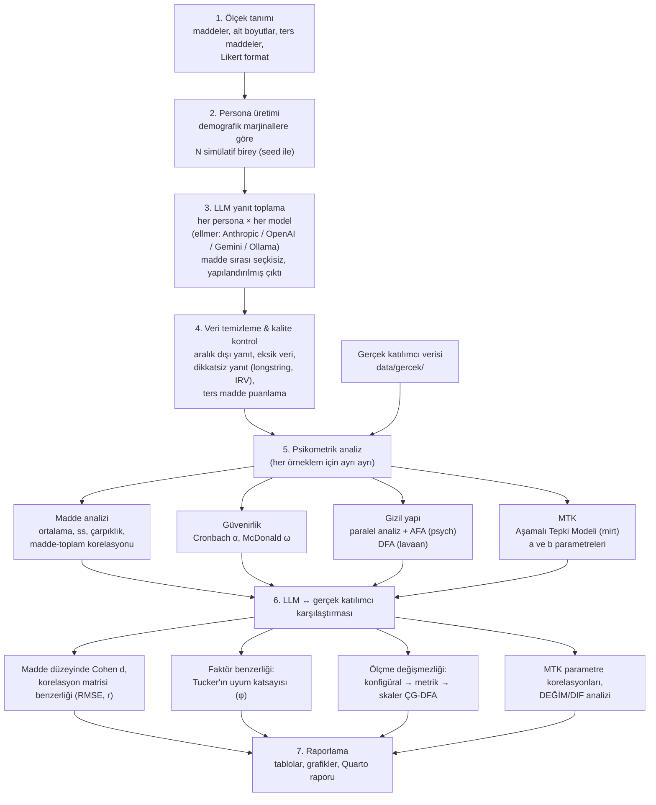

# LLM-Sim-Psikometri

Geniş dil modelleri (LLM) ile **simülatif katılımcılar** üreterek bir psikolojik ölçeğin
psikometrik özelliklerini (madde istatistikleri, güvenirlik, gizil yapı, madde parametreleri)
önceden kestirmeyi ve bu kestirimleri **gerçek katılımcı verisiyle** karşılaştırmayı amaçlayan
R projesi.

**Araştırma sorusu:** Farklı LLM'lerle üretilen simülatif bireyler, ölçeğe gerçek
katılımcılara benzer psikometrik davranış gösteriyor mu?

## Akış şeması



## Klasör yapısı

```
├── R/
│   ├── 00_kurulum.R            # paketler, yapılandırma (modeller, N, sıcaklık)
│   ├── 01_olcek_tanimi.R       # madde havuzu (örnek: Rosenberg Benlik Saygısı)
│   ├── 02_persona_uretimi.R    # simülatif birey (persona) üretimi
│   ├── 03_llm_veri_toplama.R   # ellmer ile çoklu LLM'den yanıt toplama
│   ├── 04_veri_temizleme.R     # kalite kontrol, ters puanlama
│   ├── 05_psikometrik_analiz.R # alfa/omega, AFA, DFA, MTK — örneklem başına
│   └── 06_karsilastirma.R      # değişmezlik, Tucker φ, DIF, benzerlik ölçütleri
├── run_all.R                   # tüm akışı sırayla çalıştırır
├── data/
│   ├── ham/                    # LLM'den gelen ham yanıtlar (model başına RDS)
│   ├── islenmis/               # analize hazır temiz veri
│   └── gercek/                 # gerçek katılımcı verisi (siz eklersiniz)
└── cikti/                      # tablo ve grafikler
```

## Kurulum

```r
install.packages(c(
  "tidyverse", "ellmer", "psych", "lavaan", "semTools",
  "mirt", "careless", "jsonlite"
))
```

API anahtarlarını proje kökündeki `.Renviron` dosyasına yazın (bu dosya git'e girmez):

```
ANTHROPIC_API_KEY=...
OPENAI_API_KEY=...
GOOGLE_API_KEY=...
```

Sonra RStudio'da: `source("run_all.R")` — ya da betikleri `R/` altında sırayla çalıştırın.

## Yöntemsel notlar (önemli)

- **Varyans sorunu:** LLM'ler gerçek bireylerden daha "temiz" ve daha az değişken yanıt
  verme eğilimindedir (şişmiş α, aşırı yüksek faktör yükleri). Bu yüzden her personaya
  zengin bir yaşam bağlamı verilir ve `sicaklik = 1` kullanılır.
- **Döngüsellik riski:** Personalara hedef gizil özelliğin düzeyini doğrudan söylemek
  ("benlik saygısı yüksek biri ol") yapıyı elle dikte eder; varsayılan tasarımda yalnızca
  demografi + yaşam bağlamı verilir, özellik düzeyi kendiliğinden ortaya çıkar.
  `config$ozellik_tohumu_kullan = TRUE` ile alternatif koşul denenebilir (duyarlılık analizi).
- **Adil karşılaştırma:** Simülatif örneklem büyüklüğünü ve demografik marjinalleri
  gerçek örnekleme eşleyin.
- **Tekrarlanabilirlik:** Persona üretimi `set.seed` ile sabittir; LLM çağrıları
  stokastiktir — ham yanıtlar `data/ham/` altında saklanır ve analizler bu dosyalardan
  yeniden üretilebilir.
