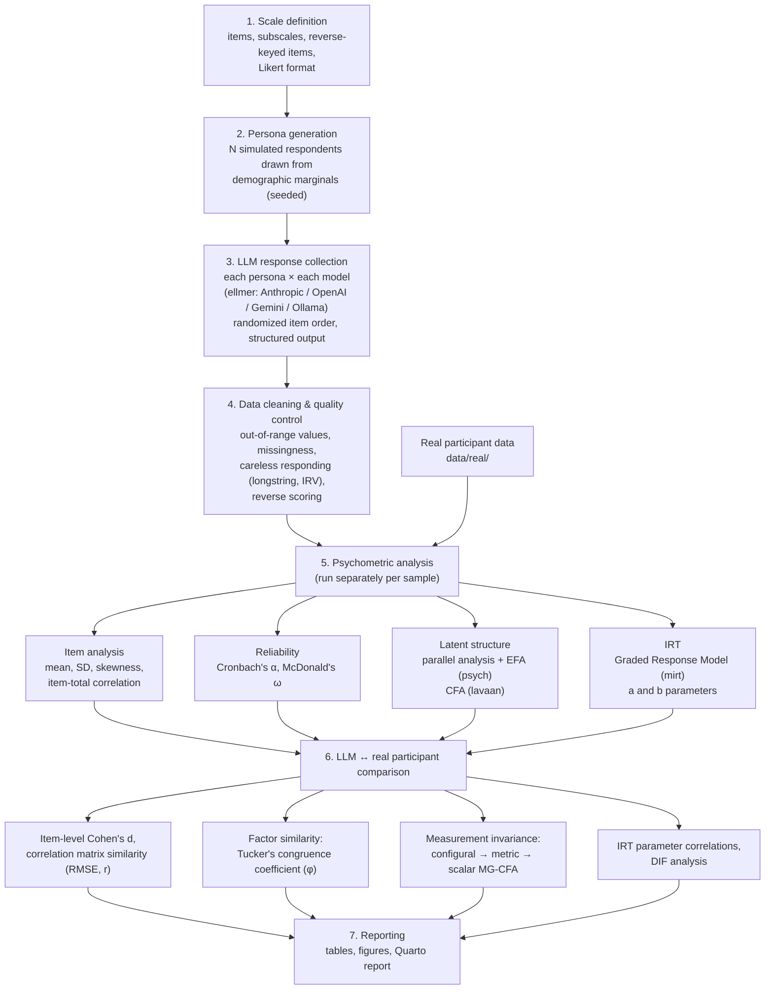

# LLM-Sim-Psychometrics

An R project that generates **simulated respondents** with large language models (LLMs)
to pre-estimate the psychometric properties of a psychological scale (item statistics,
reliability, latent structure, item parameters) and compares those estimates against
**real participant data**.

**Research question:** Do simulated respondents generated by different LLMs behave
psychometrically like real participants on the scale?

## Flowchart



## Folder structure

```
├── R/
│   ├── 00_setup.R                 # packages, configuration (models, N, temperature)
│   ├── 01_scale_definition.R      # item pool (example: Rosenberg Self-Esteem Scale)
│   ├── 02_persona_generation.R    # simulated respondent (persona) generation
│   ├── 03_llm_data_collection.R   # multi-LLM response collection via ellmer
│   ├── 04_data_cleaning.R         # quality control, reverse scoring
│   ├── 05_psychometric_analysis.R # alpha/omega, EFA, CFA, IRT — per sample
│   └── 06_comparison.R            # invariance, Tucker's φ, DIF, similarity metrics
├── run_all.R                      # runs the whole pipeline in order
├── data/
│   ├── raw/                       # raw LLM responses (one RDS per model)
│   ├── processed/                 # analysis-ready clean data
│   └── real/                      # real participant data (you provide this)
└── output/                        # tables and figures
```

## Setup

```r
install.packages(c(
  "tidyverse", "ellmer", "psych", "lavaan", "semTools",
  "mirt", "careless", "jsonlite"
))
```

Put your API keys in a `.Renviron` file at the project root (never committed to git):

```
ANTHROPIC_API_KEY=...
OPENAI_API_KEY=...
GOOGLE_API_KEY=...
```

Then in RStudio: `source("run_all.R")` — or run the scripts under `R/` in order.

## Methodological notes (important)

- **Variance problem:** LLMs tend to produce "cleaner" and less variable responses than
  real people (inflated α, overly high factor loadings). Each persona therefore gets a
  rich life context, and `temperature = 1` is used.
- **Circularity risk:** Telling personas the level of the target latent trait directly
  ("be someone with high self-esteem") dictates the structure by hand. In the default
  design only demographics + life context are given, and trait levels emerge on their
  own. Set `config$use_trait_seed = TRUE` to try the alternative condition as a
  sensitivity analysis.
- **Fair comparison:** Match the simulated sample size and demographic marginals to
  the real sample.
- **Reproducibility:** Persona generation is fixed via `set.seed`; LLM calls are
  stochastic — raw responses are stored under `data/raw/` so every analysis can be
  reproduced from those files.
